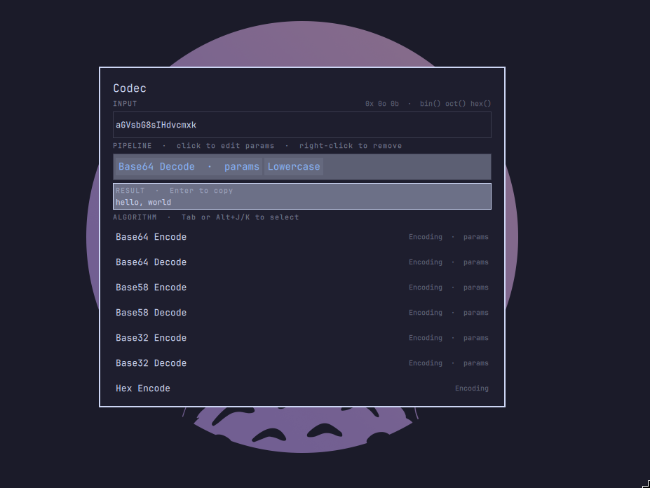

# Codec

An [Omarchy](https://omarchy.org/) shell plugin (Quickshell / QML) that chains
encode, decode and crypto transforms into a pipeline, with a built-in
number-system calculator.

Summon it with `Ctrl+Shift+C`, type or paste the input, build a pipeline of
algorithms, run it, and copy the result.



## Features

- **Chained pipeline** — pick one or more algorithms; they run in order, output
  of one feeding the next.
- **Native-fast encodings** — Base64/Base58/Base32/Hex/Binary/ASCII/URL, radix
  and text transforms run in the QML JS engine with no process spawn.
- **Crypto via `openssl`** — AES-256 (password, or raw key + IV), RSA (PEM key
  files), XOR, SHA-256/512/SHA-1/MD5 and gzip.
- **Per-step parameters** — a step that needs a password, key, IV, key file or
  a custom alphabet prompts for it when you add it, and it can be edited later.
- **Custom base tables** — Base32/Base58/Base64 accept any alphabet, so
  base64url, base32hex, Crockford and Flickr base58 are one field away.
- **Number recognition / calculator** — `0x`/`0o`/`0b` literals, `bin()` /
  `oct()` / `hex()` / `dec()`, and arithmetic pop a live result.
- **Binary-safe** — bytes flow through the pipeline untouched; a trailing hash
  is shown as text, everything else binary is shown as hex.

## Install

```sh
omarchy plugin add https://github.com/NonMirror/nonmirror.codec.git --enable
```

The plugin declares a single `overlay` entry point and has no bar widget, so
`--enable` records it in `~/.config/omarchy/shell.json` and it is loaded with
the shell.

Bind the hotkey in `~/.config/hypr/bindings.lua`:

```lua
o.bind("CTRL + SHIFT + C", "Codec (encode / decode)", "omarchy-shell shell toggle nonmirror.codec")
```

Then reload:

```sh
hyprctl reload
omarchy restart shell
```

> **Note:** binding `Ctrl+Shift+C` at the compositor level shadows terminal
> copy while focused. Move it to another chord (e.g. `SUPER + SHIFT + C`) if
> that matters to you.

## Usage

| Key | Action |
| --- | --- |
| `Ctrl+Shift+C` | Open / close Codec |
| `Tab` | Switch focus between the input and the algorithm list |
| `↑` / `↓`, `Alt+J` / `Alt+K` | Move in the algorithm list |
| type | Edit the focused field, or filter the algorithm list |
| `Enter` (input) | Run the pipeline, or copy an equation result |
| `Enter` (algorithm) | Add the highlighted algorithm (prompts for its params) |
| `Enter` (result) | Copy the result and close |
| `Ctrl+E` | Edit the last step's parameters |
| `Backspace` | In the algorithm list with an empty filter: remove the last step |
| click / right-click a chip | Edit its parameters / remove it |
| `Ctrl+V` | Paste the clipboard into the focused field |
| `Esc` | Leave the result, clear the filter, or close |

The result is shown below the input. A second `Enter` copies it to the
clipboard and closes the overlay.

## Examples

| Input | Pipeline | Result |
| --- | --- | --- |
| `SGVsbG8=` | Base64 Decode | `Hello` |
| `Hello` | Base64 Encode → Hex Encode | `534756736247383d` |
| `0xa` | Hex Encode | `0a` |
| `"0xa"` | Hex Encode | `307861` |
| `secret message` | AES-256 Encrypt → AES-256 Decrypt (key `hunter2`) | `secret message` |
| `1` | SHA-1 | `356a192b7913b04c54574d18c28d46e6395428ab` |
| `1` | SHA-1 (separator `" "`) | `35 6a 19 2b 79 13 b0 4c …` |

Custom tables (paste into the step's **Alphabet** field via `Ctrl+E`):

| Table | Alphabet |
| --- | --- |
| Base64 URL-safe | `ABCDEFGHIJKLMNOPQRSTUVWXYZabcdefghijklmnopqrstuvwxyz0123456789-_` |
| Base32 hex | `0123456789ABCDEFGHIJKLMNOPQRSTUV` |
| Crockford | `0123456789ABCDEFGHJKMNPQRSTVWXYZ` |
| Base58 (Flickr) | `123456789abcdefghijklmnopqrstuvwxyzABCDEFGHJKLMNPQRSTUVWXYZ` |

## Number recognition

When the pipeline is empty and the input is a number or equation, a live
preview appears. `Enter` copies it; `Tab` moves on to pick an algorithm.

Supported:

- Prefixes: `0x2a`, `0o52`, `0b101010`
- Functions: `bin(n)`, `oct(n)`, `hex(n)`, `dec(n)`
- Operators: `+ - * / % ** & | ^ << >>`, parentheses, unary `+ - ~`
- Mixed: `0xff & 0x0f`, `hex(0xa + 1)`

Wrap the input in single or double quotes to force it to be treated as text:
`"0xa"` is the four characters `0xa`, not the number 10.

When a number is recognised and an algorithm is picked, the pipeline receives
the number's bytes (so `0xa` + Hex Encode is `0a`).

## Algorithms

**Encoding** — Base64, Base58, Base32 (all with an optional custom alphabet),
Hex, Binary, ASCII, URL — each with Encode and Decode.

**Number** — Number → Decimal / Hex / Binary / Octal.

**Text** — ROT13, Reverse, Uppercase, Lowercase.

**Crypto** — AES-256 Encrypt/Decrypt (`password`), AES-256 Encrypt/Decrypt
(`key` + `iv`), RSA Encrypt (`public key file`) / Decrypt (`private key file`),
XOR (`key`), SHA-256 / SHA-512 / SHA-1 / MD5 (optional hex separator), Gzip /
Gunzip.

## Dependencies and privileges

The plugin runs unsandboxed inside the long-lived `omarchy-shell` process with
your own account's rights. It does not start a second Quickshell process and
does not write outside the shell's own config/state or the clipboard.

External commands it may spawn, all standard on Omarchy / Arch:

| Command | Used for |
| --- | --- |
| `openssl` | AES, RSA, SHA-256/512/SHA-1/MD5 |
| `gzip` | Gzip / Gunzip |
| `wl-copy`, `wl-paste` (`wl-clipboard`) | Read the paste buffer, copy results |
| `bash`, `base64`, `od` (coreutils) | Crypto pipelines and byte plumbing |

No Python, Node or other runtime is required. Native encodings, number bases
and the calculator run in the QML JS engine without spawning anything.

## Notes and limits

- **RSA** needs **PEM** key files (`openssl genpkey` / `openssl rsa -pubout`),
  not OpenSSH `ssh-rsa` lines. PKCS#1 v1.5 padding limits input to
  key-size minus overhead.
- **Calculator precision** uses JS `Number`, exact up to
  `Number.MAX_SAFE_INTEGER` (2^53 − 1); larger literals are approximate. Byte
  conversion is exact via arbitrary-precision base conversion.
- **Hashes** are rendered as continuous lowercase hex when they end the
  pipeline; add a separator in the step's parameters for spaced output.
- **Custom alphabets** must be 32 / 58 / 64 characters long, optionally one
  more for the padding character. Duplicates and wrong lengths are rejected.

## Remove

```sh
omarchy plugin remove nonmirror.codec
```

Then remove the `o.bind("CTRL + SHIFT + C", …)` line from
`~/.config/hypr/bindings.lua` and run `hyprctl reload`.

## License

MIT — see [LICENSE](LICENSE).
